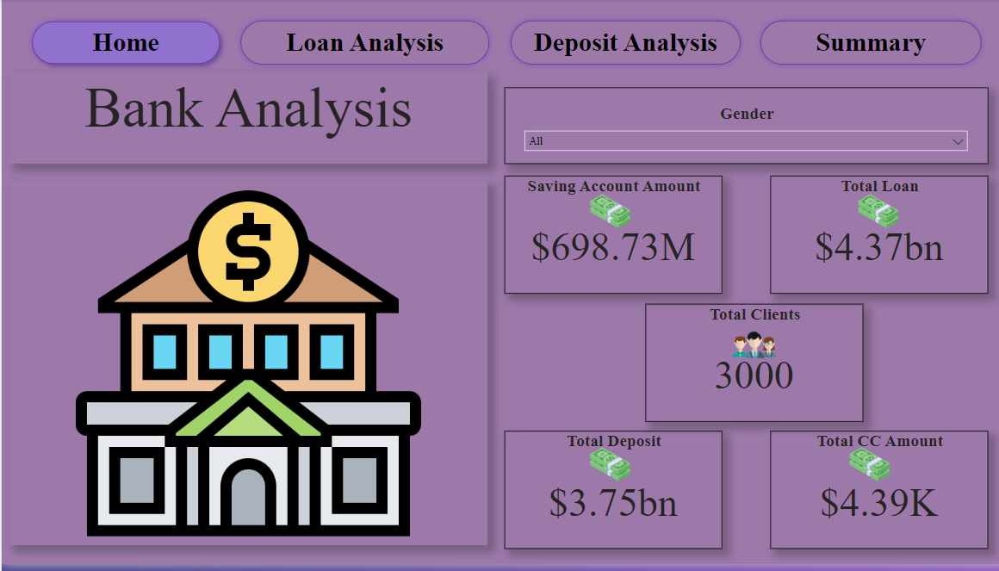
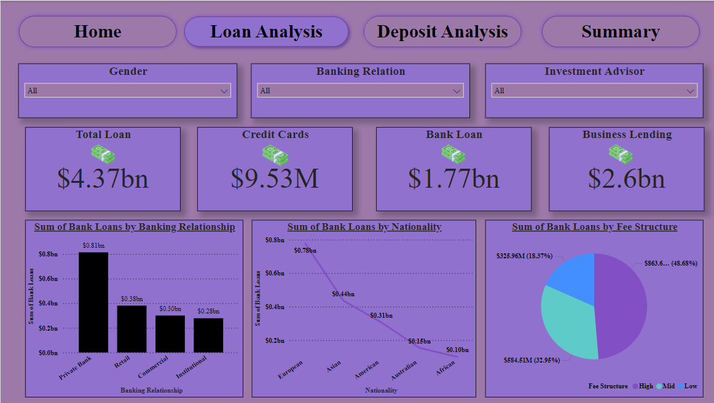
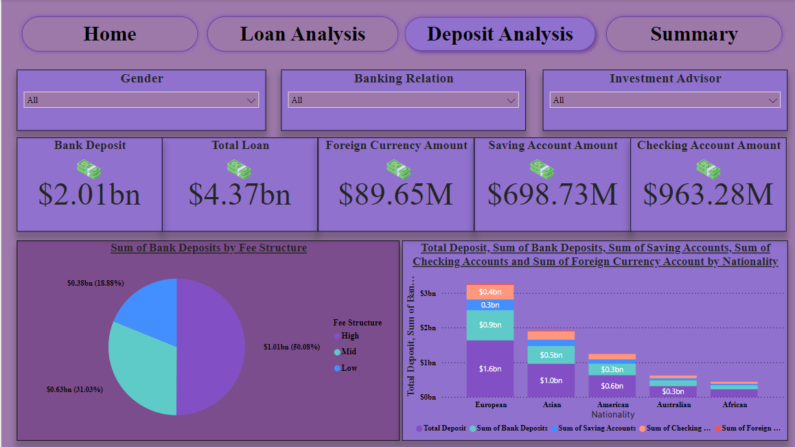
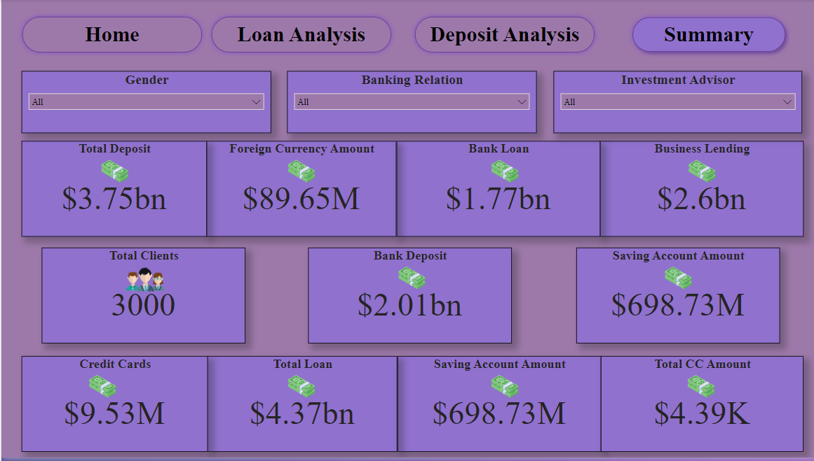

# Banking-Analysis-Power-BI-Dashboard

## Introduction
The Banking Analysis Power BI Dashboard is a comprehensive tool designed to provide insights into various banking metrics. This dashboard is developed using four primary tables and several DAX queries to deliver a detailed analysis of banking relationships, client demographics, and financial metrics.

## Data Tables

 1. Banking Relationship

This table captures the core relationship between clients and their banking services.

- Columns

1. BRID: Banking Relationship ID
2. Banking Relationship: Type of banking relationship

###
 2. Clients - Banking

This table holds detailed information about clients and their banking contracts.

- Columns

1. Banking Contracts: Information on banking contracts
2. BRID: Banking Relationship ID (Foreign Key)
3. ClientID: Unique Identifier for clients
4. Fee Structure: Fee structure associated with the banking services
5. GenderID: Gender Identifier (Foreign Key)
6. IAID: Investment Advisor ID (Foreign Key)
7. Name: Client's name
8. Nationality: Client's nationality
9. Occupation: Client's occupation

###
 3. Gender

This table provides the gender details of clients.

- Columns

1. GenderID: Unique Identifier for gender
2. Gender: Gender Description

###
 4. Gender

This table contains information about investment advisors.

- Columns

1. IAID: Unique Identifier for investment advisors
2. Investment Advisor: Name of the investment advisor

## Usage
The dashboard provides an intuitive interface to explore and analyze banking data. Users can filter data based on various parameters such as client demographics, banking relationships, and financial metrics. The visualizations include charts, graphs, and tables to offer a clear and concise representation of the data.

## Conclusion
The Banking Analysis Power BI Dashboard is a powerful tool for financial analysis and decision-making. By leveraging data from multiple sources and using DAX queries to calculate key metrics, it provides valuable insights into banking relationships, client demographics, and financial performance.

[Author](https://github.com/vivekmishra4)
